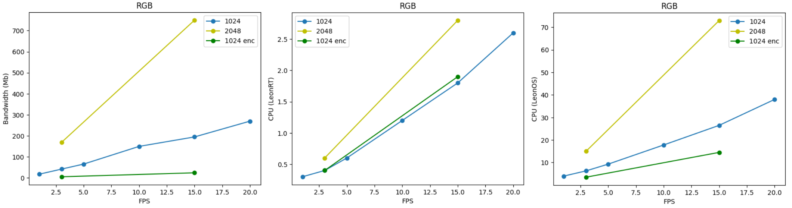

## RGB

### (1024x1024) res
| FPS  | Bandwidth | CPU (LeonOS, LeonRT) |
| ------------- | ------------- | ------------- |
| 20 | 230~270  | 38, 2.6 |
| 15  | 157~195  | 26.5, 1.8 |
| 10  | 113~150  | 17.8, 1.2 |
| 5  | 60~66  | 9.3, 0.6 |
| 3  | 36~42  | 6.3, 0.4 |
| 1  | 12~18  | 4, 0.3 |			

	
### (2048x2048) res
| FPS  | Bandwidth | CPU (LeonOS, LeonRT) |
| ------------- | ------------- | ------------- |
| 20 | 781~830  | 87, 4 |
| 15  | 705~750  | 73, 2.8	|
| 3  | 132~169  | 15, 0.6 |

### (1024x1024) res encoded
| FPS  | Bandwidth | CPU (LeonOS, LeonRT) |
| ------------- | ------------- | ------------- |
| 20 | 30~41.5  | 25.5, 2.8 |
| 15  | 23.5~24.5  | 14.5, 1.9 |
| 10  | 18.3~19.3  | 12.5, 1.3 |
| 5  | 8.9~9.75  | 6.5, 0.68 |
| 3  | 4.5~5.6  | 3.5, 0.4 |
| 1  | 1~2.3  | 2.5, 0.18~0.29 |

	
> NOTE: cropping to 1024x1024 from both 12 MP and 1080 P utilizies same CPU		

## LR Monos

### (1280x800) res
| FPS  | Bandwidth | CPU (LeonOS, LeonRT) |
| ------------- | ------------- | ------------- |
| 20 | 300~345  | 49, 3.5 |
| 15  | 230~260  | 37, 2.5 |
| 10  | 150~185  | 24.5, 1.9 |
| 5  | 75~110  | 12.5, 0.9 |
| 3  | 47~55  | 8, 0.55 |
| 1  | 23~31  | 5.9, 0.4 |

### (640×400) res
| FPS  | Bandwidth | CPU (LeonOS, LeonRT) |
| ------------- | ------------- | ------------- |
| 15  | 59~61  | 22.5, 3 |
| 3  | 12~14  | 5.5, 0.7 |

### (1280x800) res encoded
| FPS  | Bandwidth | CPU (LeonOS, LeonRT) |
| ------------- | ------------- | ------------- |
| 15  | 68~71  | 25, 4.8 |
| 3  | 13~18  | 5.8, 1 |

## Depth (1280x800) res

### SubPixel = T, Encoding = F	
| FPS  | Bandwidth | CPU (LeonOS, LeonRT) |
| ------------- | ------------- | ------------- |
| 20 | 288~326  | 52.5, 6.5 |
| 15  | 226~251  | 37.9, 3.8 |
| 10  | 154~196  | 25.1, 2.6 |
| 5  | 74~80  | 12.8, 1.3 |
| 3  | 47~52.5  | 8.5, 0.8 |
| 1  | 23.5~31  | 6, 0.5 |			

### SubPixel = F, Encoding = F
| FPS  | Bandwidth | CPU (LeonOS, LeonRT) |
| ------------- | ------------- | ------------- |
| 15  | 216~238  | 37, 3.8 |
| 3  | 47~53  | 8.5, 0.8 |

### SubPixel = T, Encoding = T*
| FPS  | Bandwidth | CPU (LeonOS, LeonRT) |
| ------------- | ------------- | ------------- |
| 15  | 25.8~28  | 20.7, 3.8 |
| 3  | 5~6  | 4.7, 0.85 |	
> *had to use "disparity" because 16-bit depth is not encodeable

## Disparity

### (1280x800) res, SubPixel = T
| FPS  | Bandwidth | CPU (LeonOS, LeonRT) |
| ------------- | ------------- | ------------- |
| 20 | 86.5*  | 36, 2.3 |
| 15  | 86.4*  | 32, 1.9 |
| 10  | 86.3*  | 28, 1.8 |
| 5  | 85.7  | 23, 1.35 |
| 3  | 53.4  | 14.3, 0.82 |
| 1  | 31.6  | 5~10, 0.6 |			

> *timings correspond to 5 fps

### (1280x800) res, SubPixel = F
| FPS  | Bandwidth | CPU (LeonOS, LeonRT) |
| ------------- | ------------- | ------------- |
| 20 | 87.1'  | 36, 3.1 |
| 15  | 86.9'  | 33.5, 3 |
| 10  | 86.7'  | 29, 2.5 |
| 5  | 42.6  | 14.7, 1.25 |
| 3  | 31.2  | 9, 0.8 |
| 1  | 15.8  | 3.5~7, 0.55 |

> 'effective fps fluctuates between 5 and 10

### (640×400) res, SubPixel = F
| FPS  | Bandwidth | CPU (LeonOS, LeonRT) |
| ------------- | ------------- | ------------- |
| 20 | 41.5~43.1  | 32, 6.8 |
| 15  | 30.3~30.8  | 24, 5.1 |
| 10  | 19.4~20.1  | 16.5, 3.4 |
| 5  | 9.9~10.9  | 8.8, 1.75 |
| 3  | 5.95~6.85  | 5.6, 1.1 |
| 1  | 3~4  | 4.3, 0.38~0.77 |

	