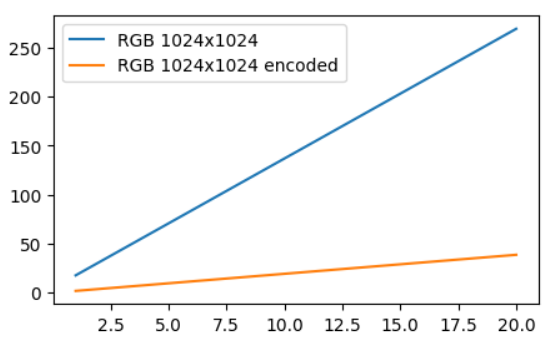

# Camera Mathematical Model

### Bandwidth

| Node              | Bandwidth Utilization |	1
| :---------------- | :------ | :------ |
| RGB 1024x1024        |   13.25*FPS + 4.25   |	 |
| RGB 2048x2048           |   40.63*FPS + 68.34   | |
| RGB 1024x1024 encoded    |  1.94*FPS - 0.31   | |
| LR 1280x800 |  16.5*FPS + 15.8   | |
| LR 1280x800 encoded |  4.42*FPS + 4.75   | |
| Depth 1280x800 |  16.08*FPS + 11.39   | |

Base bandwidth deduction when combining nodes is (1.42*FPS + 0.91)

- 2048x2048 resolution is 4x more pixels than 1024x1024, as such the bandwidth utilization also becomes approx 4x.
- Encoded 1024x1024 RGB takes about 8x less bandwidth than not encoded stream.
- Encoded 1280x800 LR takes about 3.5x less bandwidth than not encoded stream.

### LeonOS

| Node              | LeonOS Consumption |
| :---------------- | :------ |
| RGB 1024x1024        |   1.78*FPS + 0.96   |  |
| RGB 2048x2048           |   4.35*FPS + 3.29   |
| RGB 1024x1024 encoded    |  1.14*FPS + 0.55   |
| LR 1280x800 |  2.34*FPS + 1.79   |
| LR 1280x800 encoded |  1.6*FPS + 1   |
| Depth 1280x800 |  2.48*FPS + 1.48   |

Base deduction when combining nodes is (-0.26*FPS + 1.78)

- Deduction for common component of Mono cameras when combining single node data of LR and Depth is:
  - LR not encoded     0.01761 * (FPS * FPS) + 0.6511 * FPS + 2.192
  - LR encoded		-0.01072 * (FPS * FPS) + 1.293 * FPS + 0.2007

### LeonRT

| Node              | LeonOS Consumption |
| :---------------- | :------ |
| RGB 1024x1024        |   0.12*FPS + 0.05   |
| RGB 2048x2048           |   0.2*FPS - 0.03   |
| RGB 1024x1024 encoded    |  0.13*FPS + 0.04   |
| LR 1280x800 |  0.17*FPS + 0.14   |
| LR 1280x800 encoded |  0.32*FPS + 0.05  |
| Depth 1280x800 |  0.31*FPS - 0.14   |

Base deduction when combining nodes is (0.014*FPS - 0.075)

- Deduction for common component of Mono cameras when combining single node data of LR and Depth is:
  - LR not encoded     -0.0092 * (FPS * FPS) + 0.3188 * FPS - 0.5269
  - LR encoded		-0.0037 * (FPS * FPS) + 0.2507 * FPS - 0.5636

- Resource contention happens when RGB and Depth are used together, modeled by:
  - RGB not encoded     -0.0157 * (FPS * FPS) + 0.0745 * FPS - 0.5886

- Encoding in general increases LeonRT consumption, modeled for RGB by:
  - RGB encoded		-0.0213 * (FPS * FPS) + 0.2800 * FPS - 0.6189

> The models for various deductions had to be represented by higher degree polynomials because of the non-linear nature of these deviations (curvature)
